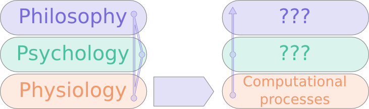
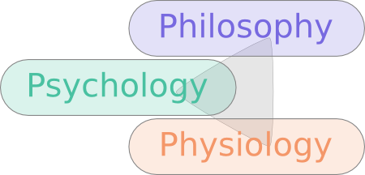
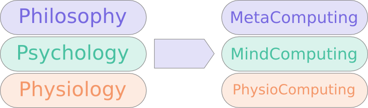

# Trifocal view on complex AI problems and new integrative approach for computational modeling

### Abstract

This paper provides a new cognitive meta-architecture for artificial intelligent systems (AI and robotics).
It is based on upgraded subsumption architecture that features an holistic and parallel series of consecutive processing.
This architecture is inspired by real anthropocentric performances, and makes posscalable
model from sensorimotor processes to symbolic. Three basic domains are the backbone
of this architecture: physiology, psychology and philosophy respectively describing
sensorimotor/physical, data processing, symbolic levels and meta levels.

## Introduction/Background

Up to now there have been several computational approaches to re-implement human phenomena like
emotions and motivations, consciousness, awareness, learning, anticipation, subjective experience,
intuition, perception and understanding, or creativity [@neucogar2015, evaluatingcomutationalmodel, computationalmodelsemotionscognition, senticcomputing, computationalmodelsemotion]. The most straight-forward approach implements a 
model by simply programming it directly. This approach is widely used in several cognitive architectures.
One disadvantage of this method, that it requires qualifications in neuroscience and psychology or philosophy from software
engineers, something that is rarely seen in practice. The other disadvantage reflects the limitation
of perspectives taken in account, usually this approach is limited to one like psychological or
philosophical with no or limited references to actual neuronal computations in the human brain.
An more realistic alternative way could be to move all the details of different perspectives into the model
and to use a bottom up approach to implement the system building, increasing the complexity from
cellular level to upper abstractions of the philosophical perspective. This approach is depicted
in  Figure 1 and was introduced in [@p3_model].

According to real human performance analysis, an anthropocentric-inspired model should take into account at least three activity layers or domains:
physiological, psychological, and philosophical.On the other hand, a robust computational system should be implemented via low-level constructs like artificial neurons or other basic cognitive bricks. This could make it easier to make a scalable system from scratch to high cognitive processes. We try to provide a new cognitive architecture, recognizing that this could be just a starting point in a discussion, but not an exhaustive explanation. 

## Cognitive Science

### Overall Picture

Natural cognitive systems are not just the sum of different specialized modules.
Most recent research has shown how the body, the mind
and some extended related varieties (symbolic tools, cognitive extensions,
ecological conditions,...) are work in parallel following a continuous interaction.
Sensorimotor processes are influenced by emotional memories that orient
attention scope, task-planning or even internal simulation mechanisms [@ferraz2009]. According
to new ideas on grounded cognition (which includes notions like embodied,
extended, situated or enactive cognition), a cognitive process is the result
of coordination among several domains. We have discretized them following a
tripartite model: physiology, psychology, and philosophy. We are neither
abandoning nor neglecting the role of socio-cultural variables (they can be added or created
later), but we consider that from a functional perspective, these three domains capture
the basis of cognitive activity.

Our attempt is related but not reducible to the 'cognitive hexagon' model widely known in
cognitive sciences [@miller2003]. Our model takes into account only three functional activities that define a cognitive process from a broadly understood bodily perspective: from a formal perspective Philosophy, Anthropology and Linguistics are different instantiations
of symbolic processes (individual or social ones). In this sense our domain called 'philosophy'
is not equivalent to the historical domain of Philosophy, but works on how a system creates
symbolic semantic and syntactic values or strategies. And from a bodily perspective, Neuroscience
is embedded into our physiological domain. 

We assume at the same time that the ways we process information at psychological and
philosophical levels are influenced following a broad range of distributions of socio-cultural
variables, but in any case they are not part of the cognitive mechanism. The symbolic and cultural
values are added by a social training process that can be partially reproduced (think for example
of Luc Steel's Language Games [@steels], if we consider robot-robot learning processes; on in HRI supervised
training) or can be directly programmed into artificial cognitive memories.

### Relations of the Domains

Our model runs perpetual loops among all the domains, without a central-control structure, despite the crucial role of the philosophical level (where we could place the 'artificial consciousness'). Obviously, from a systemic perspective, it is a layered model, but the interactions are open among these levels.

Even considering the superstructure of 'consciousness', regarding it as an integrative control system, the rest of
systems work in parallel solving problems at several levels. It is the same way
as human brain activity: running bodily, sensorimotor, simulating processes
beyond any conscious control.
At the same time, it emulates the intentional
nature of human brains, always processing information according to pre-wired structural
necessities based on morphological constraints. The only difference between our model and
a natural being with a similar one is that the intentionality that guides the system is
pre-programmed by us instead of being the result of evolutionary forces.

## New Domains Definitions

Each of three domains is made of basic elements, which we call "bricks", and consider
them functional units that solve system necessities or strategies.

From a physiological perspective, the body is built by materials that shape it, as well as sensors
that provide information which will be processed by the brain; here, neuroscience provides us with
a very basic "brick" of the brain, the neuron, that actually is used as main inspiration for
artificial neural networks. This living cell has an option to reorganize its connectivity hence
affecting the properties of the neural network
without any external intervention. A computational system in order to progress
should have living cell properties of reorganization.

From neurophysiological basis
emerge cognitive programs that solve adaptive problems[@cosmides]. Think for example on navigation,
mating, vision, emotional management, attention or language processing/expression, among a myriad
of possible modules. Our brains evolved for millions of years to produce behavior
and more specifically, social behavior.
So, from the perspective of psychology [@primer_affect_psychology, tomkins] there
are several phenomena like emotions that are grounded in neurobiological basement
of neuromodulation [@duchaine, natureofemotions, cubeofemotions] and could have significant impact on the computational system especially a neurobiologically inspired one
[@affective_computing_book,computational_emotional_thinking,computationalmodelsemotion].
Emotional states influence decision making [@paulus2012], motivation, learning,
subjective experience, thinking [@whatdoesitmeanforcomputer] in real time systems that are
crucial for social collaborative computational systems.

From the philosophical perspective [@emotionmachine] there are several models
of consciousness that could be recreated in computational systems. Establishing a
cross-disciplinary approach of recreating from the basic constructs to the
top-level concepts we could get to the point of the emergence of important
phenomena like consciousness, understanding or thinking. At a theoretical level we can easilyidentify the bricks of philosophical performing, and they follow two different spheres: a) semantics: basic memes that are considered axioms of the reasoning process, such as god, soul,truth, reason, meaning, evidence, demonstration, cause, etc.; and b) syntax: the rules and strategies considered as good ones to produce good knowledge, that is: syllogistic, monotonic logic, non-monotonic logic, abduction, induction, deduction, simulations, emulation, heuristics, hermeneutics, common-sense (tacit knowledge), and so on.

###Integrative approach

Current cross disciplinary approaches direct us to the cross-disciplinary models that should take into account several domains. There is one more aspect of this distribution of models focus: as the result we should build the models that take into account concepts of different scales, constructing from the basic blocks of networks, with other complex structures emerging to support higher level phenomena. But from the other side we should use overall meta-pictures of complex phenomena like: consciousness, thinking, or cognition.
More generic phenomena like neuromodulation comes on stage implementing emotions here the connection to psychological and philosophical phenomena domain emerges. From the meta-perspective, such models of mental activities like "Model of six" [@emotionmachine] and "H-CogAff" [@sloman2003] provides us with the overall map to fit with low level concepts in gaining proper low level neuronal computational basis. This holistic (meta) and functional integrative approach that we call “ubique” provide us the benefits of both overall picture and understanding of actual computational neuronal mechanisms.

### PhysioComputing

PhysioComputing implements the *physiology of computing*.
It is the scientific study of the hardware and software
implementing intelligent systems/approaches that are capable of executing the
set of phenomena listed above ALS with basic "block" of ALC. It should take into account implementation details
like distributed computing systems or supercomputer systems and cellular
analogies with human organism of vital functions, life and existence in the ever-changing natural environment. The scope of PhysioComputing is to provide structural,
functional, devices-embedded, distributed, communicational aspects of the
implemented systems in a devices, chips, antennas, engines etc. with a
software that creates proper collaboration among cognitive operations.

### MindComputing

MindComputing is the *psychology of computing* and
is an academic study of phenomena of ALS
that implements main components of the artificial intelligent systems analogous
to natural intelligent systems like mind. It should consider the high level details of phenomena taking into account broader and more conceptual approaches of the
artificial mind operation based on the concepts/views/theories/hypotheses
introduced in the PhysioComputing. The scope of the MindComputing is to reproduce
the important cognitive functions of ALS, those that also make possible social collaborations
as well as generate behavior for artificial individuals.

### MetaComputing

MetaComputing is the *philosophy of computing*.
MetaComputing is the study of fundamental problems of an ALS. It should
use several views possibly based on the MindComputing and PhysioComputing concepts,
and could be an integral part of the philosophy. The creative ways of obtaining new
knowledge (this includes information management, strategies, ways to obtain raw
data) are considered on this level. As humans work inductively, abductively or
statistically, improvising in different moments and situations: this implies
the necessity of the exploration of cognitive-knowledge meta-levels. The scope
of MetaComputing includes definitions and high-level views on the problems of ALS
(organisms), artificial individuals/personalities as part and extending the
Artificial Intelligent domains. In other words, MetaComputing represents a
methodological challenge that could be solved thanks to emotional cognitive architectures.

## Justification

Instead of putting a whole human being in the center of study we propose to focus
on an artificial living system or an artificial organism and develop scientific
domains around this phenomena. From this perspective during the development of
AI systems we use only one level of abstraction that is effectively implemented
in the computational system or literally in the code. Approaches like this usually miss either low-level details in case of direct implementation of the psychological models and thus don't really work like human body works, or lacks the references to high-level phenomena like emotions (which are at the same time low-level information selecting/modulating mechanisms). We could refer to works of Marvin Minsky [@minsky1988, emotionmachine] and Aaron Sloman [@sloman2003] that incorporate this trifocal view on the problems like consciousness or thinking.

In the pursuit of the emulation of the basic properties of human beings (intelligence, creativity, attention, and so on) several attempts have been made, parsing the complex behavior of human mind into "feasible" expert domains.

Once some small successes have been achieved, the necessity of increased performance of these artificial cognitive systems has faced researchers with a hard problem: how to make a system that integrates dynamic, multidimensional and scarce data, all of them present in decision-making processes in open environments. The general trend has been to turn the interest from the mind, as the first symbolic AI
approaches did, to the grounded cognitive paradigms [@Barsalou2008]. 

In a nutshell, a holistic view about the human body and their multilevel cognitive processes (sensorimotor, social, emotional, symbolic) has been increasingly implemented. But none of the previous models have considered this process as a necessary and unified project; our ubique (holistic and functional) model suggests this for the first time, establishing clear functional correlation among activity domains. This makes it possible to understand how to approach artificial emotions or even artificial consciousness. For functional purposes, we've selected three domains that make this analysis possible.

### Morphological

Morphology is the basis of the whole system, and it is never neutral: it is oriented
to some specific actions. Our model is a simplified but powerful way to design
computational layers of action. It is not a simple new subsumption architecture,
but an integrated way to understand a cognitive system. Obviously, it has a
subsumption architecture, but this doesn't explain its whole dynamics.
It is not a question of some specific terms or classifications, it is a question
about a research approach. The complexity of the consciousness problem demands
the use of an ubique approach: literally take in account low-level and high-level
details in one model. Our trifocal ubique approach is considered to provide benefits of both functional and holistic approaches in
one model, this way all the complexity is concentrated in the theoretical model
not in the implementation programmatic or robotic.

### Technological

The neurobiologically inspired revolution that is going at the current moment demands new technologies starting from the base of transistors and integrated circuits [@neurocomputing]. Current hardware architectures are not effective to satisfy today requirements: to simulate 1% of human brain RIKEN specialists used
250 supercomputers 'K'[@RIKEN]. At the same time new perspectives to use computational power
compared to human brain draws new demands of the hardware-software architecture of new computational
systems that would be capable of: everyday-life decision making in real time, social communications
and collaborations, consciousness, human-like thinking, understanding of humans and their life problems
to be effective in collaborations with people and capable of helping solving complex problems of nearest
future.

There is a very important technical point that we also solve with our model:
the statistical mind. Most uses of statistical techniques in AI are implemented
following a symbolic approach. With a grounded vision of a cognitive process, we would be able to design Bayesian-inspired techniques that emerge from a cooperation between domains, basically from sensorimotor coordination. This adds a more natural way of embodying natural calculations, following a modal perception and integration
model, although our system can implement any amodal-working method shown as robust and
reliable enough. We show the path towards a real mixture of modal and amodal
sets of data performed interactively by our three domains.

### Philosophical

With the advances of cognitive sciences, specially thanks to neurology, the notions of grounded, embedded, situated or extended cognition emerged.We can talk about a **systems cognition model**, an idea we've created in
order to answer to the real properties of cognitive events. Here, several functional layers can be identified at the same time that the continuous interaction of these layers is respected by this ubique (holistic and functional bottom up)approach. Human brains and bodies
are performing several connected but at the same time separated cognitive processes (body regulation, sensorimotor evaluation, outputs simulation, emotional managing, task planning, ...). Our model allows to discretize and to merge at the same time these three basic perspectives of cognitive managing.

## Future Possible Applications

Our model is ubique: holistic as well as functional bottom up approach that could
help to design robots with a global functional identity. Robots with integrated
functionalities thought from scratch are more efficient thanks to the necessity
of the elements that integrate the system. At the same time, it could help to create
of less predictable but more rich behaviors. It is reinforced by the social nature of our architecture. A "cognitive" is a being that tries to survive reacting
to the environments and other living entities. It is true even at the basic level
of bacterial communication and cooperation. Our trifocal approach could make it
easier to design robots with specific and unique characters or moods. This could
help to achieve innovative ways of dealing with new psychological problem of robots.

## Conclusion

The new wave into AI architectures will surely come thanks to the implementation
of biologically inspired architectures. This is a generally accepted view among
the community (emotional architectures, neuromorphic chips, emotional NN,
neuromodelling,...). But at the same time, the psychological and naturally
generated symbolic levels have still not been added to these architectures. Despite
the existence of swarm robotics or even social robotics and affective computer
advances, no similar architecture has been provided until now. We provide
an ubique: integrative, modular, dynamic and decentralized cognitive architecture
that solves several requirements from the complex necessities of contemporary AI and robotics.

##Acknowledgment

We thank Dr. Marat Minlebaev and Alexander Tchitchigin for the critical reading and useful comments.
