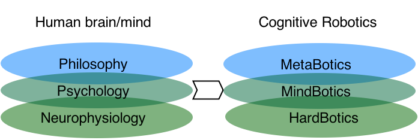

#Neuromodulating Artificial Minds
AGI-2015 proposal
 

##1. Introduction
AI efforts towards the design of intelligent machines have been usally focused into expert systems working in very narrow, static and closed enviromentments. At the same time, the underlying logic that is used by those systems follows a classic predicate logic approach or some structural corollaries. When considering the creation of  a new AI useful for artificial agents working into dynamic multitask environments, we need a new logics able to deal with several challenges. Some recent attempts are based on probabilistic logics with Bayesian flavour. We suggest even an alternative way: an emotional non-monotonic logic inspired by brain neuromodulators that regulate cognitive processes in human beings. From this new perspective, a simulated embodied machine could replicate emotional procedures into their task decision/performance activities, partially emulating  the biochemical mechanisms that rule most mammals and, specially, human beings. A dynamic and complex enviroment can be captured and managed more efficiently by an artificial cognitive system able to priorize according to 'emotional memories' and well as to design diverse strategies according to the existing mood (excitement, alert, worry,...). Complex task solving and even the existence of metaalgorithms able to create new sequential decision procedures must be reguled by emotional architectures. They have shown to be excellent through the selection of natural evolution. The more emotional complexity, the more efficient and diverse solutions. At the same time, we are working on 'best approximation' procedures according to evolving scenarios and data. Our conceptual framework is that of the interdisciplinary field of Anthropic-Oriented Computing (AOC, which lays at the intersection among sociology, neuroscience, philosophy, anthropology, psychology and computer science.

##2. The emergence of cognitive properties

All living entities show informational processing skills, a characterisc necessary for the survival. Even non-neural organisms like bacteria, plants or fungi are able to perform information integration and multiattribute decision making. And even very simple entities like Myxobacteria share socially their physiological states through C-factor proteins: Myxococcus xanthus integrate information about individual and group-level starvation to make collective decisions [non_neural]. Thus different cooperative group behaviours are possible. The researches of minimal cognition experts have shown us that at the core of any living entity there is the existence of an informational process that regulate the interactions or behaviour of those entities. The meaning or data is obtained through bodily chemical reactions (like chemotaxis,  a movement of an organism in response to a chemical stimulus that is performed by somatic cells, bacteria, and other single-cell or multicellular organisms in order to direct their movements according to certain chemicals densities in their environment; this is important for bacteria to find food (e.g., glucose) by swimming toward the highest concentration of food molecules, or to flee from poisons (e.g., phenol)). 
Here, the notion of 'body', from basic unicellular to complex multicellullar organisms, is basic and justifies the existence of a whole research paradigm labelled under the main idea of Ground Cognition (GC) [Barsalou2008]. GC implies different views such as embodied cognition, situated cognition, morphological cognition, extended cognition, among other approaches. The poiny here is to admit that the final actions of a living entity (even into the womb!, see [cognitive robotics]) are mediated by their bodies, their situated framework or environment, of their bodily states or of their (sensorymotor) simulations (that is, a physical reasoning).  And beyond the specific task performed, in some cases like in human beings, there is an affective state, an abstract reasoning, a social cognitive process that regulate the final output. If the brain contain at its heart amodal symbols, whatever they can be, their syntax is definitively emotional. 

##3. The role of neuromodulators into cognition
Neuromodulators have a crucial role into cognitive processes. Firstly, because they connect the body with the central nervous system (in our case, the brain). Secondly, because they imply a mechanism of data, evaluation, and action selection. They also make possible the existence of memories or to the social sharing of their physiological states (as happens in so through C-factor proteins by Myxoproteins). At the same time, the biological syntax of neuromodulators surpass the classic linearity or sequentiality of code lines usually expressed by programmers or logicians (GOTO is a very weak counterexample of our previous statement). In fact, neuromodulators play their role at a tridimensional level, affecting surrounding bodily areas and acting like cluster bombs. Neurotransmitters do not operate following  a lineal communication like those of nerves, but instead of it, are spreaded laterally, vertically or up/down in spinal chord. Coonsequently, it's operational activity is tridimensional. During the process glial cells make possible plasticity when modulate, amplificate or even distort a signal. Some extreme examples of this are Allodynia and Congenital Insentivity to Pain (CIP): in the first case the pain signals are extremely amplificated by neurotransmitters and it cause severe pain feelings while in the second case the signal is totally blocked and the patient cannot feel pain at all (allowing severe injuries due to the lack of control obout body damages, which are not felt). In a nutshell, neuromodulators work tridimensionally, affecting surrounding areas, triggering cascades of states that have a **temporal** and **spatial dimensional nature**. They are the basic material of memories, of meaning and of intentionality management into the bodies. In the case of memories, for example, it is well known that dopamine neurons in basal ganglia take an important role in  reward prediction. Consequently, emotional meories, sensorymotor predictions and imitative processes are strongly correlated.

##4. NEUCOGAR: a new architecture model for AI devices.

Here is presented our own approach to artificial cognitive architectures, the Neuromodulating Cognitive Architecture (NEUCOGAR). What we suggest is to create a mapping of monoamine neuromodulators applied to computational system parameters.
First of all we need to state several points:

1. Emotions are natural and necessary modulators, reinforced and modeled at the same time by social external factors or even internal thoughts;
2.	There several modular models: Geneva emotion wheel, Plutchick’s wheel of emotions, Lövheim “Cube of emotion”… all these model explain following different strategies which are the basic emotions and how are created dynamic transitions among them;
3.	Monoamine neuromodulators are the mechanistic ways by which emotional responses are triggered and modulated within cognitive systems like humans.
Our work is dedicated to modeling of mapping of impacts of monoamine neuromodulators on human brain on computational processes of modern computers. We propose the approach to correlate biochemical influence of monoamines: dopamine, serotonin, noradrenaline, involved in affective processing of cortical, limbic and other subsystems of human brain with a computational processes: computational power, memory distribution, learning, storage, decision making that take place in computational systems. It could be considered as a base of affective computation framework and we hope could be used in several domains.

**HERE CAN BE ADDED MORE DETAILS, BUT IN SHORT VERSION OF OUR MODEL NEUCOGAR.**

###4.1.Modelling with neuromodulators
Neuromodulators are the semantic bricks with which the coupling body-brain constructs internal models. At the bottom of most internal models,  we find a motor activity [f5, cerebellum] that can be summarized as a combination of an instantiation of forward and inverse models. These motor evaluation models have already succesfully applied into robotics field [isthatme]. But in no case the motor activity has been connected with emotional aspects. Our suggestion is to create a new framework for a holistic approach to robotics and AI.

###4.2.From hardbotics to mindbotics and metabotics.

In the nest image can be found summarized our holistic view of complexity levels in robotics, that is close but goes one step ahead from Computational Grounded Cognition [CGC]:

On the left, we find the bodily level at the top, with the mental processing at the second and, finally, the philosophical level at the top. It is a subsunption architecture that is how human beings work: our bodies follow morphological and structural necessities that create an intentionality into the individual (we are information gatherers, face seekers,imitative and plastic biological machines), who is managed at a mental level by mental representations and, finally, this entity can think about the own meaning of things, always within a social domain. This layered structure should be followed by robotics researches. Although it is true that robotics avoid GOFAI approaches like Stanford-Shakey, the embodied robotics that was asked for Rodney Brooks (at MIT, [Brooks]) and today still maintained by Rolf Pfeiffer (at ETH, [Pfeiffer]) is still focused into sensorimotor level, which we call *hardbotics*. But robots have minds that capture and process information, and neuromodulators could help us to create amodal ways to manage this process, that we call *mindbotics*. Finally, the semantic entity can create meanings from scratch (in fact from its own situatedness condition), something that me've called *metabotics*. This last is a metalevel, where creativity, innovation, heuristical choice is possible. And we solve the Ariadne's thread thanks to synthetic neuromodulators architectures.

##5. Conclusions 

After an analysis of the mainly strategies for constructing articial minds, we've suggested neurotransmitters as the cornerstone from which construct the whole architecture of an advanced robotic system. This system will follow its structural and morphological constraints and will be able to create its own semantic values. Our approach is close to Computational Grounded Cognition, but at the same time suggest a body mechanism that makes possible the emergence of complex behaviours and strategies: neuromodulators. We consider that it is the key piece for the connection between the body and the possible semantic metalevels. Emergence of complex behaviours is the result of neurotransmitters, and our NEUCOGAR makes possible a computational architecture that unify bodies and social minds.

##REFERENCES

see AINA references.bib file

PERSONAL NOTES:

10 total pages (text + photos + bibliography,...)

